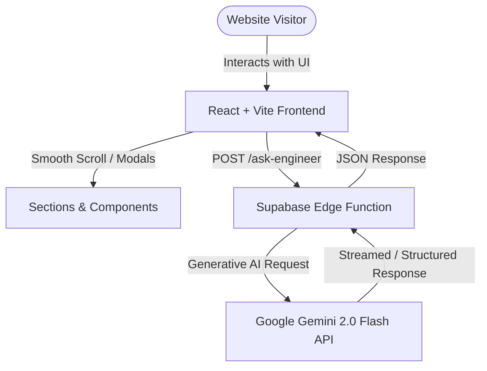
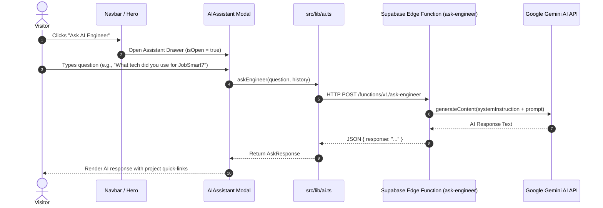

# Complete Project Documentation: Portfolio & AI Engineer Showcase

**Owner:** Rugved Surve  
**Role:** AI Engineer & Full Stack Developer  
**Location:** Pune, India  
**Repository:** `Portfolio018`  
**Tech Stack:** React 18, Vite, TypeScript, Tailwind CSS, Lucide Icons, Supabase Edge Functions, Google Gemini API  

---

## 📋 Executive Overview

`Portfolio018` is a high-performance, dark-themed interactive portfolio web application built for **Rugved Surve** (AI Engineer & Full Stack Developer). Beyond a standard static portfolio, it incorporates an **AI-powered interactive assistant** capable of answering questions about Rugved's engineering experience, skills, projects, and architecture decisions in real time.

### Key Objectives
* **Showcase Featured Projects:** Present deep-dive case studies with problem descriptions, architectural decisions, technical approaches, and measurable outcomes.
* **Interactive AI Engineer Assistant:** Provide visitors with a conversational AI agent (`ask-engineer`) backed by Supabase Edge Functions and Google Gemini.
* **Demonstrate Systems Thinking:** Highlight engineering principles, metrics, interactive system flow diagrams, and a structured timeline of experience and education.
* **Modern Aesthetic & Performance:** Deliver a glassmorphic dark-mode interface with subtle micro-animations, fast load times, and complete mobile responsiveness.

---

## 🏗️ System Architecture

The architecture consists of a lightweight, highly responsive single-page application (SPA) client deployed on static hosting, communicating securely with a serverless edge backend hosted on Supabase Edge Functions.



### Component Architecture & Data Flow



---

## 📁 Repository Directory Structure

```
Portfolio018/
├── .bolt/                  # Bolt workspace configuration
├── .gitignore              # Git ignore configuration
├── eslint.config.js        # ESLint flat configuration (ES2022 + React Hooks)
├── index.html              # HTML shell with viewport, fonts, and meta tags
├── package.json            # Project metadata and dependencies
├── package-lock.json       # Locked dependency versions
├── postcss.config.js       # PostCSS plugins (Autoprefixer, Tailwind)
├── tailwind.config.js      # Custom theme, colors, font families, and animations
├── tsconfig.json           # Base TypeScript configuration
├── tsconfig.app.json       # Frontend application TS configuration
├── tsconfig.node.json      # Node/Vite build tool TS configuration
├── vercel.json             # Vercel deployment routing configuration
├── vite.config.ts          # Vite build options & `@` path alias configuration
├── public/                 # Static assets (favicons, icons, manifest)
├── src/
│   ├── main.tsx            # React application entry point
│   ├── App.tsx             # Main layout shell and state router
│   ├── index.css           # Tailwind directives & global utility styles
│   ├── vite-env.d.ts       # Vite TypeScript ambient declaration
│   ├── data/
│   │   ├── portfolio.ts    # Centralized profile, projects, metrics, principles, timeline
│   │   └── ai-suggestions.ts # Suggested starter prompts for the AI Assistant
│   ├── lib/
│   │   └── ai.ts           # Supabase edge function API client wrapper
│   └── components/
│       ├── layout/
│       │   ├── Navbar.tsx  # Sticky header with navigation links & AI trigger
│       │   └── Footer.tsx  # Footer with social links & copyright info
│       ├── sections/
│       │   ├── Hero.tsx               # Hero headline, CTA buttons, quick tags
│       │   ├── CredibilityStrip.tsx   # Trust strip with key engineering badges
│       │   ├── SelectedWork.tsx       # Grid of featured project cards & filter UI
│       │   ├── CaseStudyModal.tsx     # Fullscreen deep-dive modal for project case studies
│       │   ├── EngineeringApproach.tsx# Principles & interactive architecture diagram
│       │   ├── TechStack.tsx          # Categorized tech stack tabs & skill grid
│       │   ├── Metrics.tsx            # Key engineering impact metrics & counters
│       │   ├── About.tsx              # Detailed biography & profile overview
│       │   ├── Timeline.tsx           # Interactive career, education & milestones timeline
│       │   ├── ResumeCTA.tsx          # High-converting resume download section
│       │   ├── Contact.tsx            # Email contact form & direct social links
│       │   └── AIAssistant.tsx        # Floating AI drawer with chat history & quick prompts
│       ├── ui/
│       │   ├── Button.tsx             # Reusable button variant component
│       │   ├── SectionHeader.tsx      # Unified section title & subtitle component
│       │   └── SocialLinks.tsx        # Render social network icons (GitHub, LinkedIn, Email)
│       └── visuals/
│           ├── ProjectVisual.tsx      # SVG/CSS dynamic visual placeholders for projects
│           └── SystemFlowDiagram.tsx  # Interactive visual system architecture flow
└── supabase/
    ├── config.toml         # Supabase CLI project settings
    └── functions/
        └── ask-engineer/
            └── index.ts    # Supabase Deno Edge Function with Gemini integration
```

---

## 🛠️ Tech Stack & Key Dependencies

### Frontend Framework & Styling
* **React 18:** Modern functional components, hooks (`useState`, `useCallback`, `useEffect`).
* **TypeScript 5.5:** Strict type safety across components, project data schemas, and API handlers.
* **Vite 5.4:** Ultra-fast HMR dev server and optimized production bundler.
* **Tailwind CSS 3.4:** Custom design tokens, glassmorphism, responsive breakpoints, dark themes.
* **Lucide React:** Modern icon set for UI actions, tech tags, and navigation icons.

### Backend & Edge AI Services
* **Supabase Edge Functions:** Serverless Deno runtime hosted globally at the edge.
* **Google Gemini API (`gemini-2.0-flash`):** High-speed LLM for dynamic context-aware Q&A.

---

## 🔍 Core Features & Implementation Details

### 1. Dynamic Case Study System (`SelectedWork.tsx` & `CaseStudyModal.tsx`)
Each project in `src/data/portfolio.ts` includes structured metadata:
* **Context & Problem Statement:** Real-world pain point solved.
* **Engineering Decision:** Architecture trade-offs and rationale.
* **Approach & Solution:** How the system was designed and built.
* **Outcome & Impact:** Quantifiable results.
* **Interactive Visuals:** Dynamically rendered based on project type (`dashboard`, `analytics`, `terminal`, `mobile`) via `ProjectVisual.tsx`.

### 2. AI Engineer Assistant (`AIAssistant.tsx` & `supabase/functions/ask-engineer`)
* **Context Injection:** The Edge Function feeds Rugved's full profile, project summaries, and technical skills into the Gemini system prompt.
* **Fallback Strategy:** Graceful fallback response handling if the Gemini API key is unconfigured or rate-limited.
* **Project Linking:** Visitors can ask about a specific project and click directly to open its case study modal.

### 3. Engineering Principles & Flow Visualizer (`EngineeringApproach.tsx` & `SystemFlowDiagram.tsx`)
* Displays architectural mindset (e.g., *Type Safety & Reliability*, *Data Integrity*, *Modular System Design*).
* Features an interactive diagram visualizing data flow from Client UI -> API Layer -> Database -> AI/Scraping Pipeline.

### 4. Categorized Tech Stack (`TechStack.tsx`)
* Interactive tabs allowing visitors to filter skills by:
  - All Technologies
  - AI & Machine Learning
  - Backend & Databases
  - Frontend Development
  - DevOps & Cloud Tools

---

## 📊 Data Models Reference

Defined in [`src/data/portfolio.ts`](file:///d:/New%20folder%20%284%29/Portfolio018/src/data/portfolio.ts):

```typescript
export type Project = {
  id: string;
  number: string;
  category: string;
  title: string;
  shortDescription: string;
  problem: string;
  context: string;
  role: string;
  approach: string;
  challenge: string;
  solution: string;
  outcome: string;
  engineeringDecision: string;
  technologies: string[];
  links: {
    github?: string;
    demo?: string;
    docs?: string;
  };
  layout: 'image-left' | 'image-right' | 'full-width' | 'compact';
  visual: {
    type: 'dashboard' | 'analytics' | 'terminal' | 'mobile';
    label: string;
  };
};
```

---

## 🚀 Setup & Local Development Guide

### Prerequisites
* **Node.js:** v18.0.0 or higher
* **npm:** v9.0.0 or higher (or pnpm / yarn)
* **Supabase CLI:** (Optional, required only for local Edge Function testing)

### Installation Steps

1. **Clone the repository:**
   ```bash
   git clone https://github.com/rugved18-dev/Portfolio018.git
   cd Portfolio018
   ```

2. **Install dependencies:**
   ```bash
   npm install
   ```

3. **Configure Environment Variables:**
   Create a `.env` file in the project root:
   ```env
   VITE_SUPABASE_URL=https://your-supabase-project.supabase.co
   VITE_SUPABASE_ANON_KEY=your-supabase-anon-key
   ```

4. **Start the Development Server:**
   ```bash
   npm run dev
   ```
   Open your browser at `http://localhost:5173`.

5. **Type Check & Lint:**
   ```bash
   npm run typecheck
   npm run lint
   ```

6. **Build for Production:**
   ```bash
   npm run build
   ```

---

## ⚡ Deployment Instructions

### Frontend (Vercel)
1. Push your repository to GitHub.
2. Connect your repository in Vercel Dashboard.
3. Set root directory to `./`.
4. Add environment variables `VITE_SUPABASE_URL` and `VITE_SUPABASE_ANON_KEY`.
5. Deploy. (The included `vercel.json` ensures clean single-page app rewrite handling).

### Backend (Supabase Edge Function)
1. Log in to Supabase CLI:
   ```bash
   npx supabase login
   ```
2. Link to your Supabase project:
   ```bash
   npx supabase link --project-ref <your-project-ref>
   ```
3. Set the Gemini API key secret in Supabase:
   ```bash
   npx supabase secrets set GEMINI_API_KEY=your_gemini_api_key
   ```
4. Deploy the `ask-engineer` function:
   ```bash
   npx supabase functions deploy ask-engineer --no-verify-jwt
   ```

---

## 🤝 Maintenance & Content Customization

* **Updating Personal Bio & Profile Info:** Edit `profile` object in [`src/data/portfolio.ts`](file:///d:/New%20folder%20%284%29/Portfolio018/src/data/portfolio.ts).
* **Adding New Projects:** Add a new item to `projects` array in [`src/data/portfolio.ts`](file:///d:/New%20folder%20%284%29/Portfolio018/src/data/portfolio.ts).
* **Modifying AI Prompt Rationale:** Edit `supabase/functions/ask-engineer/index.ts` to adjust the system instruction context.

---

*Document compiled on: 2026-09-03*  
*Project Repository: Rugved Surve Portfolio (`Portfolio018`)*
